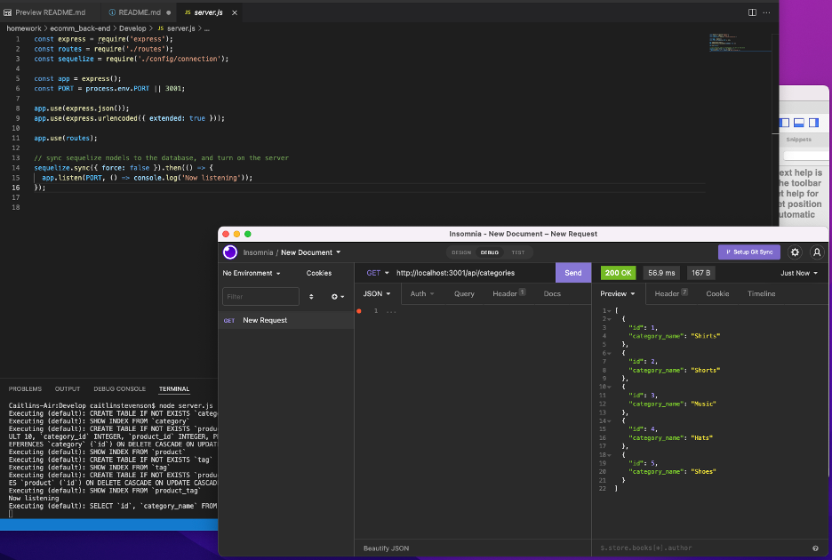

# Caitlin Stevenson | E-Commerce Back End Assignment

## Objectives

In this project, I added to starter code to create an e-commerce back end using object-relational mapping. I integrated MySQL2 and Sequelize packages to connect my Express.js API to MySQL database. I created database models for categories, products, tags, and product-tags and added to provided API routes to perform RESTful CRUD operations. I then seeded the database and was able to run basic CRUD operations, which I tested in Insomnia.

## User Instruction

A user will need to run the npm install in their terminal to get started. The user can then set up their dotenv file using the .env.EXAMPLE file as reference. Next the user will need to set up their mySQL database in workbench using the provided schema and seed their database by running npm run seed in their terminal, then the user will be able to enter the node server.js command to turn on the local server.

## Video of Project in Use

[Video of project in use](https://drive.google.com/file/d/1gW0di2Opk0odMQ3jlr7cae5THA8ywAnI/view?usp=sharing)

## GitHub Link

[Link to GitHub Repo](https://github.com/caitlinscodes/ecomm_back-end)

## License

This code is licensed under the MIT License.